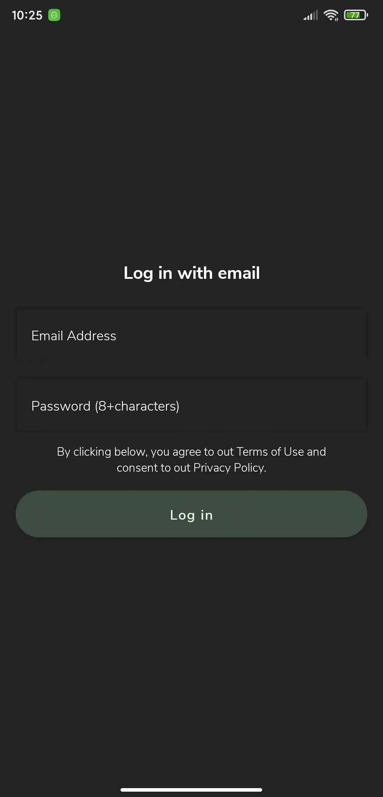
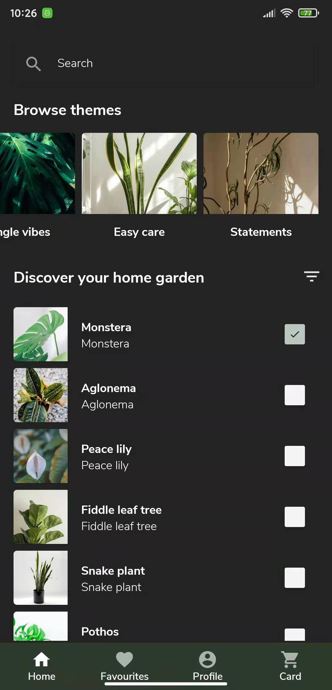

# Bloom

<!--- Replace <OWNER> with your Github Username and <REPOSITORY> with the name of your repository. -->
<!--- You can find both of these in the url bar when you open your repository in github. -->


## :scroll: Description
My entry for Week 3 Android Developer Challenge

## :bulb: Motivation and Context
Participate in speedrun and see how fast I can design the provided mock

## :camera_flash: Screenshots


### ☀️ Light Mode
|:----------------------------------------:|:-----------------------------------------:|:-----------------------------------------: |
|  |  |  |

### 🌙 Dark Mode
|:----------------------------------------:|:-----------------------------------------:|:-----------------------------------------: |
|  |  |  |

> I don’t know why, my emulator pixel 4 has a problem with dark mode

## License
```
Copyright 2020 The Android Open Source Project

Licensed under the Apache License, Version 2.0 (the "License");
you may not use this file except in compliance with the License.
You may obtain a copy of the License at

    https://www.apache.org/licenses/LICENSE-2.0

Unless required by applicable law or agreed to in writing, software
distributed under the License is distributed on an "AS IS" BASIS,
WITHOUT WARRANTIES OR CONDITIONS OF ANY KIND, either express or implied.
See the License for the specific language governing permissions and
limitations under the License.
```